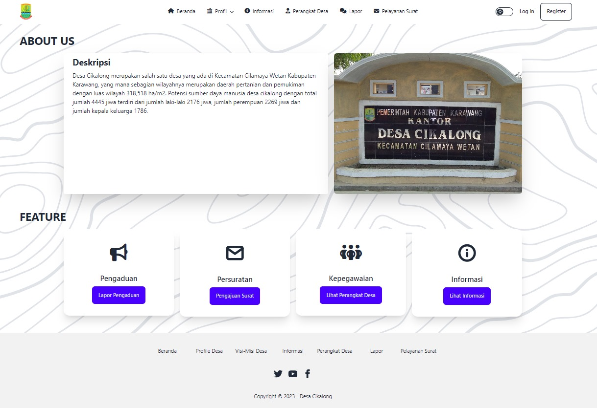

# Sistem Pelayanan Masyarakat
My personal project which was created for a thesis entitled "Designing a website-based community service system in a village using the Laravel framework" which aims to facilitate community services in the village, in terms of making it easier for the community to make letters and also public complaints regarding problems in the village without having to visit the village office offline.

Watch [this youtube Demo Video:](https://www.youtube.com/watch?v=xdvGBKGDf28)

